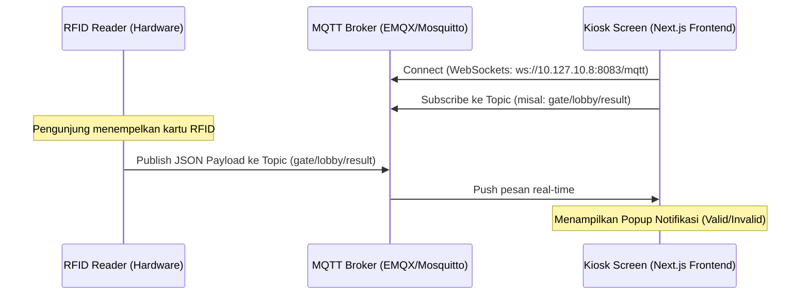

# Panduan Setup & Uji Coba MQTT (Tanpa Webhook)

Sistem Smart Gate Universal Kiosk ini menggunakan protokol **MQTT** untuk mengirimkan notifikasi hasil scan kartu RFID secara real-time ke layar Kios Next.js.

---

## 1. Arsitektur Aliran Data (Tanpa Webhook)

Sistem ini **tidak memerlukan Webhook** atau HTTP polling. Komunikasi berlangsung secara dua arah dan real-time menggunakan arsitektur **Pub/Sub (Publish/Subscribe)**:



1. **Next.js Kiosk UI** berjalan di browser dan melakukan koneksi WebSockets langsung ke MQTT Broker (`ws://10.127.10.8:8083/mqtt`) lalu mendengarkan (*Subscribe*) topik yang dikonfigurasi.
2. **RFID Reader** (atau script Python controller RFID) melakukan *Publish* data kartu ke broker MQTT setiap kali kartu di-scan.
3. **MQTT Broker** langsung meneruskan (*Push*) data tersebut ke browser Kios secara real-time tanpa penundaan.

---

## 2. Persiapan MQTT Broker di Lokal (`10.127.10.8`)

Anda membutuhkan MQTT Broker yang berjalan di IP `10.127.10.8`. Anda bisa memilih salah satu opsi broker berikut:

### Opsi A: Menggunakan EMQX (Sangat Direkomendasikan)
EMQX sangat cocok karena mendukung WebSockets secara default di port `8083`.
1. **Download & Jalankan EMQX** melalui Docker:
   ```bash
   docker run -d --name emqx -p 1883:1883 -p 8083:8083 -p 18083:18083 emqx/emqx:latest
   ```
2. **Port Penting:**
   - `1883` : TCP Port (Digunakan oleh Flask Backend untuk cek status online & Hardware RFID Reader).
   - `8083` : WebSockets Port (Digunakan oleh Next.js Frontend Kiosk di browser).
   - `18083`: Dashboard Admin EMQX (buka di browser: `http://10.127.10.8:18083` dengan user/pass default: `admin`/`public`).

### Opsi B: Menggunakan Eclipse Mosquitto
Jika menggunakan Mosquitto, pastikan Anda mengaktifkan WebSockets di file konfigurasi `mosquitto.conf`:
```ini
listener 1883
protocol mqtt

listener 8083
protocol websockets
```
Jalankan Mosquitto dengan konfigurasi tersebut:
```bash
mosquitto -c mosquitto.conf
```

---

## 3. Langkah-Langkah Pengujian Lokal

### Langkah 1: Jalankan Flask Backend & Next.js Frontend
Pastikan kedua server berjalan lokal:
- Flask Admin: `http://localhost:5000`
- Kiosk Frontend: `http://localhost:3000`

### Langkah 2: Konfigurasi Kios di Dashboard Admin
1. Buka `http://localhost:5000/login` (admin / admin123).
2. Daftarkan Kiosk baru dengan:
   - **TV ID:** `TV-LOBBY`
   - **MQTT Topic:** `gate/lobby/result`
3. Buka layar kios di browser: `http://localhost:3000?tv_id=TV-LOBBY`.
4. Perhatikan bagian pojok kiri bawah layar Kios, pastikan status koneksi broker menampilkan: **`Connected (Aman)`**.

### Langkah 3: Kirim (Publish) Data Simulasi Scan Kartu

Gunakan aplikasi MQTT Client seperti **MQTTX** (GUI) atau perintah CLI untuk mengirimkan pesan simulasi ke topik `gate/lobby/result`.

#### Format Payload 1: Akses Diterima (Valid)
Kirim pesan ini untuk mensimulasikan kartu member yang valid:
- **Topic:** `gate/lobby/result`
- **Payload (JSON):**
```json
{
  "status": "valid",
  "name": "Rifandi",
  "message": "Berlaku s/d Juni 2027"
}
```

#### Format Payload 2: Akses Ditolak (Invalid)
Kirim pesan ini untuk mensimulasikan kartu tidak dikenal atau kedaluwarsa:
- **Topic:** `gate/lobby/result`
- **Payload (JSON):**
```json
{
  "status": "invalid",
  "name": "Kartu Tidak Dikenal",
  "message": "Silakan hubungi loket pendaftaran"
}
```

---

## 4. Troubleshooting Koneksi MQTT

* **Error: `Disconnected` / `Offline` di Kios:**
  Pastikan port `8083` terbuka di mesin broker (`10.127.10.8`) dan protokol yang digunakan browser adalah WebSockets (`ws://`). Browser **tidak bisa** terhubung ke port TCP biasa (`1883`).
* **Error: Kredensial Koneksi:**
  Next.js Kiosk dikonfigurasi untuk terhubung dengan username `kiosk_nextjs` dan password `sandi_next`. Pastikan broker Anda tidak memblokir koneksi anonim atau telah terkonfigurasi dengan user tersebut jika otentikasi diaktifkan.
